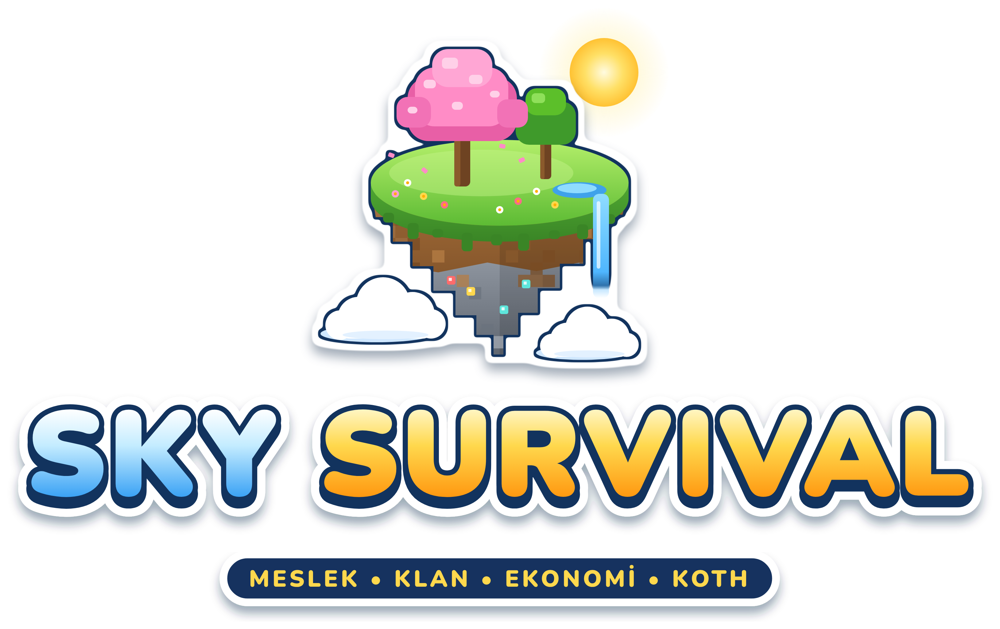
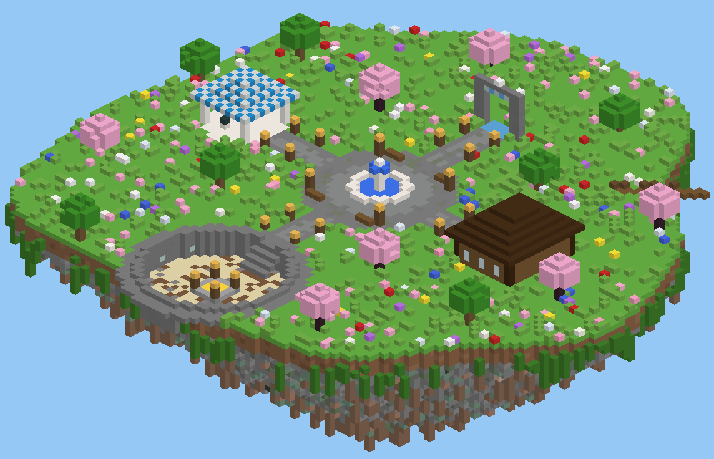
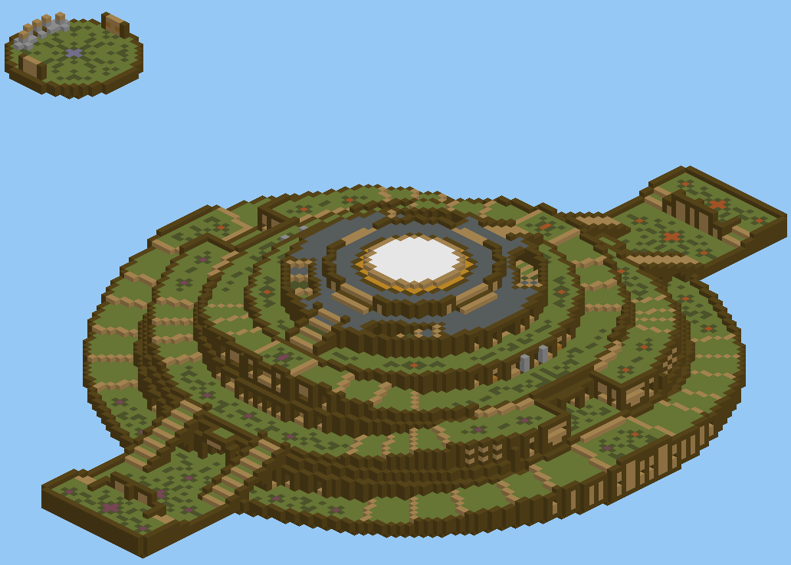

# Sky Survival — Herkese Açık Minecraft Sunucusu

<p align="center"></p>

Meslek, yetenek ve ekonomi odaklı, herkese açık bir **Survival** sunucusu (Paper).

- **Minecraft Java 26.1.2** — ViaVersion/ViaBackwards/ViaRewind sayesinde **1.8'den 26.x'e** kadar her sürümle girilebilir
- **Crack & Premium:** orijinal hesabı olmayanlar da girebilir (AuthMe ile şifreli kayıt), premium oyuncular `/premium` ile şifresiz girer
- **Bedrock desteği:** telefon, konsol ve Windows Bedrock oyuncuları da girebilir (Geyser + Floodgate)
- Türkçe mesajlar, ₺ ekonomi, meslekler, yetenekler, rütbeler, arazi koruması, oyuncu marketleri
- Hile koruması (otomatik atma), güçlü X-Ray engeli, test edilmiş dupe korumaları, grief kaydı, otomatik yedek, çökünce otomatik yeniden başlama
- **Gökyüzü spawn adası** tek komutla kurulur: vahşi doğa portalı, market, PvP arenası, kasalar, atlama noktası, hologramlar
- **KOTH etkinlik arenası:** internetten alınıp düzenlenen ünlü **"The Hill"** haritası (CC BY-SA 4.0) gökyüzüne kurulur
- Sunucuya özel yazılmış **SkyCore** eklentisi: sunucu marketi, klanlar, kasalar, KOTH etkinliği, rastgele ışınlanma, savaş modu,
  sohbet oyunları, banknot, kelle avı, günlük ödül serisi, aktiflik ödülü
- **Survival kolaylıkları:** ölünce eşyalar mezara girer, eğilerek ağaç devirme ve damar kazma, sağ tıkla hasat,
  günlük görevler, yeni oyuncu PvP koruması, güvenli takas menüsü
- Hazır **vektör logo (SVG + PNG), sunucu ikonu, banner'lar, tanıtım kartı ve metinleri** ([`branding/`](branding))

---

## Oyuncular ne yapabilir?

| Özellik | Komut / nasıl |
|---|---|
| İlk girişte kayıt, sonra giriş | `/register <şifre> <şifre>`, `/login <şifre>` |
| Orijinal hesapla şifresiz giriş | `/premium` (bir kez yazmak yeterli) |
| Skin değiştirme | `/skin <oyuncu-adı>` (crack oyuncular da skin kullanabilir) |
| Meslek seçip çalıştıkça para kazanma (madenci, oduncu, çiftçi, avcı...) | `/jobs` |
| Yetenek kasma (madencilik, savaş, tarım...) ve güçlenme | `/skills` |
| Arazi koruma, arkadaş ekleme | Altın kürekle köşeleri işaretle, `/trust <oyuncu>` |
| Sandıkla market kurma, başkasının marketinden alışveriş | Sandığa eşya koy, sandığa vurup fiyat yaz |
| Para işlemleri | `/bal`, `/pay`, `/baltop` |
| Sunucu marketi (al / sat) | `/market`, `/sat` (elindekini sat), `/sat hepsi` |
| Ev ve ışınlanma | `/sethome`, `/home`, `/tpa`, `/spawn`, `/warp`, `/vahsi` (rastgele yere git) |
| Klan kurma, klan evi, klan kasası, klan sohbeti | `/klan`, `/ks <mesaj>` |
| Kasa açma (anahtarla) | `/warp kasalar` → kasaya sağ tık (sol tık: ödüller) |
| Tepenin Kralı etkinliği (her akşam) | `/koth`, `/koth katil` (arenaya git) |
| Günlük ödül (seri yaptıkça artar) ve günlük kit | `/odul`, `/kit gunluk` |
| Parayı kağıda çevirip takas etme | `/banknot <miktar>`, kağıda sağ tık = para |
| Birinin kellesine ödül koyma | `/kelle koy <oyuncu> <miktar>`, `/kelle liste` |
| Sohbet oyunları (ilk bilen para kazanır) | Sohbete gelen soruyu ilk yaz |
| Oturma / uzanma | `/sit`, `/lay`, `/crawl`, merdivene sağ tık |
| Ölünce eşyalar kaybolmaz: mezarına girer, sağ tıkla geri al | `/mezar` (mezarlarının yeri) |
| Ağacı tek seferde devirme / madeni damarıyla kazma | Eğil (Shift) + baltayla kütük, kazmayla maden kır |
| Ekini sağ tıkla topla (kendiliğinden yeniden ekilir) | Olgun ekine sağ tık |
| Her gün 3 yeni görev, bitirince para ve kasa anahtarı | `/gorev` |
| Güvenli takas (dolandırılma yok) | `/takas <oyuncu>`, `/takas kabul` |
| Yeni oyuncu koruması (ilk 1 saat PvP yok) | `/koruma` |

Rütbeler: **Oyuncu → VIP → Moderatör → Admin**.

### Spawn adası



Yeni oyuncular gökyüzündeki adada başlar. Kuzeydeki **Vahşi Doğa portalından** geçen dünyada rastgele bir yere ışınlanır;
kuzeydoğudaki **atlama iskelesinden** atlayan süzülerek (paraşütle, hasar almadan) dünyaya iner. Doğuda **market**, güneyde
**PvP arenası**, batıda **kasalar** var. Ada korumalıdır; adada hasar, açlık ve düşman yaratık yoktur.
Kurulum: oyunda admin olarak `/skycore kurulum onayla` (ayrıntı: [SkyCore README](custom-plugins/SkyCore/README.md)).

### KOTH arenası: "The Hill"



Her akşam yapılan **Tepenin Kralı** etkinliği, Overcast Network'ün ünlü KOTH haritası **"The Hill"** üzerinde oynanır
(yapımcılar: Articray, TheZaner, xXFracXx; katkı: ItsMiiOlly, ElectroidFilms; lisans: CC BY-SA 4.0). Harita
[OvercastCommunity/PublicMaps](https://github.com/OvercastCommunity/PublicMaps) deposundan alındı, 1.8 bloklarından güncel
sürüme çevrildi ve spawn adasının güneyine gökyüzüne kurulur. Ortadaki katmanlı tepenin üstünden fener ışını yükselir;
iki uçta üsler, batıda yapımcıların kafaları ve tabelalarıyla küçük bir tanıtım adası var.
`/warp koth` tanıtım adasına, `/koth katil` doğrudan arenaya götürür. Arena korunur ama PvP açıktır; düşen oyuncu paraşütle iner.

---

## Gereksinimler

- **Java 25 veya daha yenisi** → <https://adoptium.net/> (JDK 25, kurarken *Add to PATH* işaretli olsun)
- Sunucuya ayırabileceğin **en az 6–8 GB RAM** (herkese açık sunucu için; test için 4 GB yeter)
- Açılacak portlar:
  - `25565` **TCP** → Java oyuncuları
  - `19132` **UDP** → Bedrock oyuncuları

## Hızlı başlangıç

1. Zip'e **sağ tıkla → "Tümünü ayıkla" (Extract All)** ile bir klasöre çıkar.
   Zip'in içinden doğrudan çalıştırma; Windows o zaman sadece tek dosyayı çıkarır ve kurulum çalışmaz.
2. Başlat:
   - **Windows:** `server/start.bat` dosyasına çift tıkla.
   - **Linux / macOS:** `cd server && ./start.sh`
3. İlk açılışta:
   - Paper (`server.jar`) ve eksik eklentiler resmi sitelerinden **otomatik indirilir**,
   - Minecraft EULA'yı kabul edip etmediğin sorulur (`e` yaz),
   - sunucu açılır.
4. Konsolda `Done` yazısını görünce oyuna `localhost` (aynı bilgisayar) ya da sunucunun IP adresiyle gir ve
   **hemen `/register <şifre> <şifre>` ile kaydol** (crack sunucuda adını başkası alamasın diye).
5. [`server/setup/ilk-kurulum-komutlari.txt`](server/setup/ilk-kurulum-komutlari.txt) içindeki komutları konsola yapıştır
   (rütbeler, yetkiler, kendini admin yapma, dünya ön-oluşturma). Sonra `stop` yaz; sunucu kendiliğinden yeniden açılır ve X-Ray koruması devreye girer.
6. Oyuna admin olarak gir ve **`/skycore kurulum onayla`** yaz: gökyüzü spawn adası ve "The Hill" KOTH arenası; spawn noktası,
   warplar, hologramlar, kasalar ve KOTH tepesiyle birlikte birkaç saniyede kurulur.

RAM miktarını `start.bat` içindeki `set RAM=4G` satırından değiştirebilirsin (Linux'ta `RAM=8G ./start.sh`).

**Sunucuyu kapatmak / yeniden başlatmak:** konsola `stop` yaz → 10 saniye içinde otomatik yeniden açılır (çökmelerde de).
Tamamen kapatmak için pencereyi kapat ya da `CTRL+C`. Oyun içinden `/restart` de kullanılabilir (sunucu kapanır, 10 saniyede geri açılır).

---

## Herkese açık sunucu için önemli notlar

- **Evde barındırma riskli:** Evden açarsan ev IP adresin oyunculara görünür ve DDoS (saldırı) ile internetin kesilebilir.
  Herkese açık sunucu için **DDoS korumalı bir Minecraft hosting** firması ya da VPS kullan.
- **Alan adı:** `oyna.seninsunucun.com` gibi bir alan adı al; IP değişse bile oyuncular aynı adresle girer.
- **VIP satışı (Minecraft kuralları):** Mojang, herkese açık sunucularda **parayla oyun avantajı satmayı yasaklar**.
  VIP'ye sadece kozmetik şeyler verebilirsin (renkli yazı, önek, `/nick`, `/hat`). Bu yüzden hazır VIP yetkileri sadece kozmetiktir.
  VIP'yi parayla değil oylama ya da oyun süresiyle veriyorsan istediğin yetkiyi ekleyebilirsin.
- **Crack açık (`online-mode=false`) — güvenlik çok önemli:** Herkes istediği isimle girebildiği için seni ve yetkilileri koruyan tek şey
  **AuthMe şifresi**. Sunucu açılınca oyuna **ilk sen gir** ve `/register` ile kaydol, ancak ondan sonra kendini admin yap.
  Orijinal hesabın varsa `/premium` yaz; o isim artık sadece orijinal hesapla kullanılabilir. **`op` kullanma**, yetkiyi LuckPerms ile ver.
  Şifresini unutan oyuncu için: `/authme unregister <oyuncu>`.
- **Kurallar:** `server/plugins/Essentials/rules.txt` (oyunda `/rules`). Grief olursa: `/co inspect` ile kim yaptı bak, `/co rollback` ile geri al.

---

## Dupe ve hile korumaları

Herkese açık ve crack açık bir sunucuda en çok uğraştıran şey dupe (eşya çoğaltma), bedava para açıkları ve hilelerdir. Hepsi test edilip kapatıldı:

| Konu | Ne yapıldı |
|---|---|
| **Bilinen Minecraft dupe'ları** | Paper; TNT, ray/halı, piston ile kırılamaz blok kırma, end portalı dupe'larını kendisi kapatır. `config/paper-global.yml` → `unsupported-settings` altındaki ayarları **açma**. |
| **X-Ray** | Paper Anti-Xray güçlü mod (`engine-mode: 2`): hileci sahte cevher yağmuru görür; elmas, altın, antik kalıntı dahil 19 cevher gizli. |
| **Fly, speed, killaura, reach...** | GrimAC. Yetkililer uyarı görür; çok yüksek ihlalde oyuncu **otomatik atılır** (ban değil), yetkili yokken de koruma sürer (`plugins/GrimAC/punishments.yml`). |
| **SkyCore açıkları** | 16 ayrı dupe/hile denemesi otomatik testlerde yapılıp engellendiği doğrulandı: savaştan kaçma, takas/market/kasa menülerinden eşya çalma, ölünce takas eşyasını koruma, sahte banknot, `NaN`/eksi miktarlar, pistonla görev kasma ve adaya blok itme, alt hesapla ödül katlama, iksirle PvP korumasını aşma. Liste: [SkyCore README](custom-plugins/SkyCore/README.md#dupe-ve-hile-korumaları). |
| **Market ile para basma** | Minecraft'ın bütün tarifleri tarandı: "marketten al → üret/erit/böl → markete sat" ile para kazanılamıyor. Zümrüt satılamaz (köylüler çubuğa zümrüt verdiği için). Fiyatları değiştirirsen: `python3 tools/market_kontrol.py`. |
| **Meslek (Jobs) para kasma** | Oyuncu öldürmeye para kaldırıldı (alt hesabı öldürüp para kasma), slime bloğu yap-boz döngüsü kaldırıldı, spawner yaratıkları, huniyle doldurulan fırın/simya standı para vermez, koyduğun bloğu kırmak para vermez, mesleklerden saatlik kazanç sınırı var (`plugins/Jobs/generalConfig.yml`). |
| **Alt hesaplar** | AuthMe IP başına en fazla 3 hesap; günlük ve aktiflik ödülü IP başına 2 hesaba; kelle ödülü aynı IP'den alınamaz. |
| **Grief ve hırsızlık** | Araziler HuskClaims ile korunur; CoreProtect her bloğu ve sandığı kaydeder (`/co inspect`, `/co rollback`). |

---

## Eklentiler

`server/setup/plugins.json` listesindeki eklentiler otomatik indirilir ve güncellenir.

| Eklenti | Ne işe yarar |
|---|---|
| **LuckPerms** | Rütbe ve yetki sistemi. Tarayıcıda düzenlemek için: `/lp editor` |
| **AuthMe** | Crack oyuncular için kayıt/giriş, premium oyunculara şifresiz giriş, bot ve şifre deneme koruması — Türkçe |
| **PacketEvents** | AuthMe'nin premium hesapları doğrulaması için gerekli kütüphane |
| **SkinsRestorer** | Crack oyunculara skin (`/skin <ad>`) |
| **EssentialsX** (+ Chat, Spawn) | `/home` `/tpa` `/spawn` `/warp` `/kit` `/msg` `/pay` `/bal`, ban/mute ve ekonomi |
| **VaultUnlocked** | Ekonomi köprüsü (Vault'un güncel hâli) |
| **Jobs Reborn** (+ CMILib) | Meslekler, çalıştıkça para kazanma (`/jobs`) — Türkçe |
| **AuraSkills** | mcMMO tarzı yetenek ve seviye sistemi (`/skills`) — Türkçe |
| **WorldEdit** + **WorldGuard** | Harita düzenleme ve bölge koruma |
| **CoreProtect** | Blok/sandık kayıtları, grief geri alma: `/co inspect`, `/co rollback` |
| **HuskClaims** | Altın kürekle arazi koruma, `/trust <oyuncu>` ile arkadaş ekleme |
| **GrimAC** | Hile koruması (fly, speed, killaura...). Moderatörler uyarıları görür, çok yüksek ihlalde otomatik atar |
| **DriveBackupV2** | 3 saatte bir otomatik yedek (`server/backups/`, son 24 saat saklanır). Elle: `/drivebackup backup` |
| **ViaVersion** + **ViaBackwards** + **ViaRewind** | 1.8'den en yeni sürüme kadar her Minecraft sürümüyle giriş |
| **Geyser** + **Floodgate** | Bedrock (telefon/konsol) oyuncular girebilir |
| **PlaceholderAPI** | Skor tablosunda para, rütbe vb. göstermek için |
| **TAB** | Tab listesi başlığı, rütbe önekleri, yan skor tablosu (`/sb` ile gizlenir) |
| **QuickShop-Hikari** | Sandığa eşya koyup market kurma |
| **GSit** | `/sit` `/lay` `/crawl`, merdivene sağ tıklayıp oturma |
| **DecentHolograms** | Yüzen yazılar (spawn adasındakiler otomatik kurulur) |
| **Chunky** | Dünyayı önceden oluşturur, gezerken lag olmaz |

### Sunucuya özel eklenti: SkyCore

Yurtdışı ve Türk survival sunucularında sevilen özellikleri araştırıp tek bir Türkçe eklentide yazdık:
`server/plugins/SkyCore-1.1.0.jar` (kaynak kodu: [`custom-plugins/SkyCore`](custom-plugins/SkyCore)).

| Özellik | Ne yapar |
|---|---|
| **Spawn adası + KOTH arenası** | `/skycore kurulum onayla` → gökyüzüne hazır ada ve "The Hill" arenası; spawn, 6 warp, 11 hologram, 3 kasa, KOTH tepesi otomatik. Korumalı, paraşütle iniş |
| **Sunucu marketi** | `/market` → 8 kategori, 190+ eşya, sol tık al / sağ tık sat; `/sat hepsi`. Fiyatlar `market.yml`'de |
| **Klanlar** | `/klan kur <isim>` → davet, klan evi, ortak kasa, `/ks` klan sohbeti; klan arkadaşları birbirine vuramaz; etiket TAB'da görünür |
| **Kasalar** | Günlük / Nadir / Efsane kasa; anahtarla sağ tık → dönen çark → ödül. Anahtarlar: `/odul`, aktiflik ödülü, KOTH, 7 günlük seri |
| **KOTH** | Her gün 20:00 ve 22:30'da "The Hill" arenasındaki tepeyi 2 dk tutan kazanır (5000₺ + Efsane anahtarı); `/koth katil` |
| **Vahşi doğa** | `/vahsi` → 500-5000 blok arası rastgele güvenli yere ışınlanma (portal da bunu kullanır) |
| **Savaş modu** | PvP'ye giren 15 sn `/spawn` `/home` `/tpa` gibi kaçış komutlarını kullanamaz; savaştayken oyundan çıkan ölür, eşyaları düşer |
| **Sohbet oyunları** | 10 dk'da bir sohbete soru: ilk yazan / işlemi çözen / karışık kelimeyi bulan para kazanır |
| **Banknot** | `/banknot 1000` → para kağıda döner, sağ tıkla geri yatar (takas için) |
| **Kelle avı** | `/kelle koy <oyuncu> <miktar>` → onu öldüren parayı alır (aynı IP'den alınamaz) |
| **Günlük ödül serisi** | `/odul` → her gün artan ödül, bir gün kaçırınca sıfırlanır |
| **Aktiflik ödülü** | AFK olmadan her 60 dk oynayana 500₺ |
| **Mezar** | Ölünce eşyalar ve XP oyuncunun kafası şeklindeki mezara girer (lavda yanmaz, kimse çalamaz); 15 dk sadece sahibi açar, 60 dk sonra dökülür. PvP'de eşyalar normal düşer |
| **Ağaç devirme / damar kazma / sağ tık hasat** | Eğilerek baltayla ağacın tamamı, kazmayla bitişik madenler kırılır; olgun ekine sağ tık hasat + yeniden ekim. Arazi koruması, Jobs parası ve AuraSkills XP'si normal çalışır |
| **Günlük görevler** | `/gorev` → her gün 3 rastgele görev (kaz, kes, öldür, balık, hasat, pişir, üret); ödül + hepsi bitince bonus ve Nadir anahtar. Kendi koyduğun blok sayılmaz. Görevler `gorevler.yml`'de |
| **Yeni oyuncu koruması** | İlk 60 dk PvP'de vurulmaz/vuramaz (arenalar hariç); `/koruma kapat` |
| **Güvenli takas** | `/takas <oyuncu>` → iki taraflı menü, ikisi de onaylayınca değişir; teklif değişince onaylar sıfırlanır |
| **Otomatik duyurular, kafa düşürme, ölüm koordinatı, hoş geldin başlığı** | ipuçları; PvP'de ölenin kafası düşer; öldüğün yer yazılır; girişte büyük başlık |

Tüm mesajlar ve miktarlar `server/plugins/SkyCore/config.yml` içinden değiştirilebilir (ilk açılışta oluşur), sonra `/skycore reload`.
**`/discord` ve `/site` adreslerini oradaki `bilgi` bölümüne kendi adreslerinle yazmayı unutma.** Ayrıntı: [SkyCore README](custom-plugins/SkyCore/README.md).

**Ek olarak Paper'ın kendi X-Ray koruması** ikinci açılışta otomatik ve **güçlü modda** açılır (`config/paper-world-defaults.yml`):
X-Ray kullanan oyuncu her yerde sahte cevher görür, Nether'daki antik kalıntı (netherite) da gizlenir. Ayrıntı: [Dupe ve hile korumaları](#dupe-ve-hile-korumaları).

**İsteğe bağlı (kapalı, açmak için `"enabled": true` yap):**

| Eklenti | Ne işe yarar |
|---|---|
| DiscordSRV | Oyun sohbetini Discord kanalına bağlar (Discord bot token gerekir) |
| BlueMap | Tarayıcıdan açılan 3D canlı harita (TCP `8100`) |

> Paper zaten **spark** performans aracını içinde getirir: lag olursa `/spark profiler start`.

### Eklenti açmak / kapatmak / eklemek

- **Kapatmak:** `plugins.json` içinde o eklentiye `"enabled": false` ekle → bir sonraki açılışta `.jar` silinir (ayarları kalır).
- **Modrinth'ten yeni eklenti eklemek:** listeye şunu ekle (`project` = Modrinth adresindeki isim):
  ```json
  { "id": "ornek", "name": "Örnek", "source": "modrinth", "project": "ornek-eklenti" }
  ```
- **Elle eklemek:** `.jar` dosyasını doğrudan `server/plugins/` içine atabilirsin; kurulum aracı listede olmayan dosyalara dokunmaz.

### Güncelleme

Sunucu **kapalıyken** `server/update.bat` (Linux: `./update.sh`) çalıştır. Paper ve tüm eklentiler en yeni uyumlu sürüme güncellenir.
İndirilen sürümler `server/setup/lock.json` dosyasında tutulur; güncellemeden sonra bir sorun olursa o dosyayı geri alıp tekrar başlatman yeterli.

---

## Dil durumu: her şey Türkçe mi?

Evet. Oyuncuların gördüğü her şey, oyunlarının dili ne olursa olsun **Türkçe**. Türkçesi olmayan eklentileri biz çevirdik:

| Eklenti | Nasıl Türkçe |
|---|---|
| **SkyCore** (bizim eklenti), **AuthMe**, **Jobs**, **AuraSkills** | Türkçe yazıldı / dil ayarı Türkçe |
| **EssentialsX** | Kendi çevirisinde eksik 103 mesajı ve 321 komut kullanım satırını biz tamamladık (`plugins/Essentials/messages/messages_tr.properties`) |
| **HuskClaims** (arazi koruma) | Türkçesi yoktu; 239 mesajın hepsini biz çevirdik |
| **TAB** | 49 mesajın hepsini biz çevirdik (`/sb` dahil) |
| **DecentHolograms** | Türkçesi yoktu; 130 mesajın hepsini biz çevirdik |
| **QuickShop**, **SkinsRestorer**, **GSit** | Oyuncunun oyun dili İngilizce olsa bile herkese Türkçe gösterecek şekilde ayarlandı |
| **CoreProtect**, **Chunky**, **WorldEdit** | Dil ayarı Türkçe |
| **GrimAC** (hile koruması) | Grim'in Türkçe ayar/mesaj dosyaları eklendi, yarım kalan satırlarını biz tamamladık (`plugins/GrimAC/`) |
| **ViaVersion** | Oyuncuya giden tüm atılma mesajları Türkçe |
| **PlaceholderAPI** | evet/hayır ve tarih biçimi Türkçe |
| **WorldGuard** | Türkçesi yok; uyarı mesajları bölge ayarıyla Türkçe yapıldı (`ilk-kurulum-komutlari.txt` 10b) |
| Paper/Spigot ("Böyle bir komut yok", "yetkin yok", "sunucu dolu", yeniden başlatma) | Türkçe (`spigot.yml` + kurulum aracı) |
| **DriveBackupV2** | Yedek mesajları oyunculara gösterilmiyor |
| **Geyser/Floodgate**, **LuckPerms** | Bedrock cihazının / oyuncunun diline göre; Türkçe oyuncuya Türkçe |

> Not: `start` dosyaları Java'yı bilerek **İngilizce sistem diliyle** açar (`-Duser.language=en`). Türkçe Windows'ta bazı eklentiler
> "I/İ" harfi yüzünden bozulabiliyor (meşhur "Türkçe I" hatası). Eklentilerin dili bundan etkilenmez, hepsi ayrı ayrı Türkçe ayarlı.

İngilizce kalan tek yer: sunucu **konsolundaki** teknik kayıtlar (Paper ve eklentilerin açılış/hata kayıtları) ve sadece yöneticinin kullandığı
`/papi`, `/lp` gibi bazı komutların çıktıları. Oyuncular bunları görmez.
Minecraft'ın kendi yazıları (ölüm mesajları, başarımlar, menüler) ise her oyuncuda kendi oyun dilinde görünür.

## Hazır ayarlar

| Dosya | Ne ayarlandı |
|---|---|
| `server/server.properties` | Crack açık (`online-mode=false`), MOTD, 100 oyuncu, görüş mesafesi 8 / simülasyon 6 (performans), normal zorluk, spawn koruması SkyCore'da (gökyüzü adası) |
| `server/plugins/AuthMe/config.yml` | Türkçe, premium şifresiz giriş açık, IP başına en fazla 3 hesap, en az 6 karakter şifre, yanlış şifrede captcha + geçici ban, anti-bot |
| `server/plugins/Essentials/config.yml` | Dil **Türkçe**, para birimi **₺**, başlangıç parası **100₺**, ışınlanmada 3 sn bekleme (savaştan kaçış olmasın), sohbet `[Rütbe] İsim » mesaj` |
| `server/plugins/Essentials/kits.yml` | `baslangic` (ilk girişte otomatik, arazi küreği dahil), `gunluk` |
| `server/plugins/Essentials/motd.txt`, `rules.txt` | Türkçe giriş mesajı ve kurallar |
| `server/plugins/TAB/config.yml` | "SKY SURVIVAL" tab başlığı, yan skor tablosu (rütbe, para, klan, günlük seri, ping), isim altında can, klan etiketi |
| `server/plugins/Jobs/` | Türkçe dil ve meslekler (Madenci, Oduncu, Çiftçi, Avcı, Balıkçı, İnşaatçı, Kazıcı, Kaşif, Simyacı, Büyücü, Zanaatkâr, Silahçı); para kasma açıkları kapalı, saatlik kazanç sınırı |
| `server/plugins/AuraSkills/`, `GSit/` | Türkçe dil |
| `server/plugins/GrimAC/` | Türkçe mesajlar, yüksek ihlalde otomatik atma |
| `server/plugins/DriveBackupV2/config.yml` | 3 saatte bir yedek, son 8 yedek, Türkiye saati |

`enforce-secure-profile=false`: Bedrock (Geyser) ve farklı sürümlerle giren oyuncuların sohbette atılmaması için kapalı.

Geyser ilk açılışta `plugins/Geyser-Spigot/config.yml` dosyasını oluşturur; Floodgate kurulu olduğu için orada `auth-type` değerinin `floodgate` olduğundan emin ol.

---

## Hosting firmasında (Pterodactyl vb. panel) çalıştırmak

1. Panelde sunucu türü olarak **Paper 26.1.2**, Java sürümü olarak **Java 25** seç.
2. Kendi bilgisayarında bir kez `server` klasöründe `java setup/Setup.java` çalıştır (eksik eklentiler insin).
3. `server` klasörünün **içindekileri** panelin dosya yöneticisine yükle.
4. Panel kendi başlatma komutunu kullandığı için X-Ray korumasını elle aç: sunucu bir kez açılıp kapandıktan sonra kendi bilgisayarında
   `config/paper-world-defaults.yml` dosyasını indir, `server` klasöründe `java setup/Setup.java` çalıştır (dosyayı güçlü X-Ray ayarlarıyla
   günceller) ve geri yükle. Ya da elle: `anticheat` → `anti-xray` → `enabled: true`, `engine-mode: 2`.
5. Panelde Java başlatma ayarlarına (JVM flags / Startup) `-Duser.language=en -Duser.country=US` ekle (Türkçe I hatasına karşı).

---

## Klasör yapısı

```
server/
├── start.bat / start.sh       → sunucuyu başlatır (önce eksikleri indirir, kapanınca yeniden açar)
├── update.bat / update.sh     → Paper ve eklentileri günceller
├── server.properties          → temel sunucu ayarları
├── plugins/                   → eklentiler ve ayarları (SkyCore-1.1.0.jar bizim eklentimiz)
├── backups/                   → otomatik yedekler (ilk yedekten sonra oluşur)
└── setup/
    ├── plugins.json           → eklenti listesi (aç/kapat buradan)
    ├── lock.json              → kurulu sürümler (otomatik yazılır)
    ├── Setup.java             → indirme/güncelleme aracı
    └── ilk-kurulum-komutlari.txt → ilk açılışta konsola yapıştırılacak komutlar
custom-plugins/SkyCore/          → SkyCore'un kaynak kodu ve testleri
branding/                        → logo (SVG/PNG), sunucu ikonu, banner'lar, önizlemeler, .schem dosyaları, tanıtım metinleri, LISANSLAR.md
tools/                           → logo (tools/logo), spawn adası ve KOTH haritası dönüştürücüsü (import_map.py), market açık kontrolü (market_kontrol.py)
```

## Sonraki adımlar için fikirler

- **Discord sunucusu** + DiscordSRV ile sohbet köprüsü
- Sunucu listesi sitelerine kayıt + **oy verme ödülleri** (NuVotifier + oy eklentisi)
- **BlueMap** ile web'den canlı harita
- Sezonluk etkinlikler (kasaya özel ödüller, bayram etkinlikleri)
- Kaynak dünyası (her ay sıfırlanan maden dünyası), sıralama tabloları (en zengin, en çok oynayan), haftalık etkinlikler, klan savaşları

## Lisanslar ve teşekkür

- **"The Hill" KOTH haritası:** Articray, TheZaner, xXFracXx (katkı: ItsMiiOlly, ElectroidFilms) —
  [CC BY-SA 4.0](https://creativecommons.org/licenses/by-sa/4.0/). Kaynak: [OvercastCommunity/PublicMaps](https://github.com/OvercastCommunity/PublicMaps).
  Değiştirilmiş hâli (`custom-plugins/SkyCore/src/main/resources/koth/`, `branding/KothArena-TheHill.schem`) de aynı lisansla dağıtılır.
  Oyunda yapımcıların adı tanıtım adasında, KOTH hologramında ve `/koth` komutunda yazar; bunları kaldırma.
- **Nunito yazı tipi** (logo): SIL Open Font License 1.1 (`tools/logo/fonts/OFL.txt`).
- Ayrıntı: [`branding/LISANSLAR.md`](branding/LISANSLAR.md).
